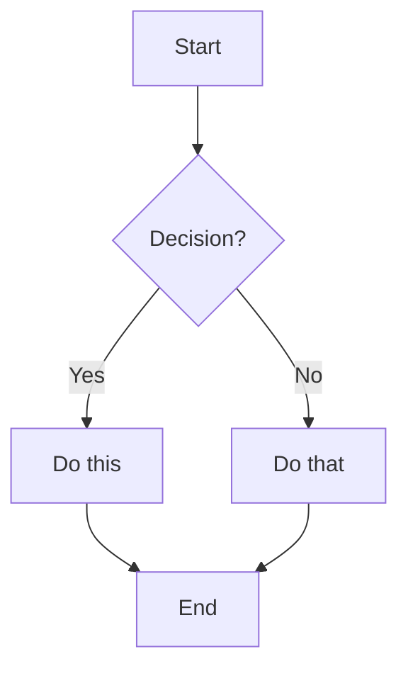

# Markdown

Original Markdown: [Daring Fireball](https://daringfireball.net/projects/markdown)

Standardized implementation: [CommonMark Spec](https://spec.commonmark.org/current/)

## Syntax

Quick overview with Markdown syntax.

| Category           | Element                 | Syntax                                            | 
|--------------------|-------------------------|---------------------------------------------------|
| **Layout**         | [Headings](#headings)   | # Heading 1<br>## Heading 2<br>### Heading 3 etc. |
|                    | [Horizontal Rule](#lists)| \-\-\-                                           |
|                    | Blank Spacer Row        | `&nbsp;`                                          |
| **Text Style**     | *Italic*                | \*Italic\* or \_Italic\_                          |
|                    | **Bold**                | \*\*Bold\*\* or \_\_Bold\_\_                      |
|                    | ***Bold Italic***       | \*\*\*Bold Italic\*\*\* or \_\_\_Bold Italic\_\_\_|
|                    | ~~Strikethrough~~       | \~\~Strikethrough\~\~                             |
|                    | `Inline Code`           | \`Inline Code\`                                   |
|                    | <mark>Highlight</mark>  | \<mark\>Highlight\</mark>                         | 
| [**Lists**](#lists)| Unordered List          | \- Item                                           |
|                    | Task Item               | \- [X] Item<br> \- [ ] Item                       |
|                    | Orderered Lists         | 1. Item<br>2. Item                                |
|                    | Table                   |                                                   |
|                    | Code Block              | \`\`\`language<br>code<br>\`\`\`                  |
| **Links & Media**  | Link                    | \[title](https://example.com)                     |
|                    | Link to Heading         | \[title](#heading)                                |
|                    | Image                   | !\[alt text](image.jpg)                           |
| **Misc.**          | Footnote                | \[^1] + \[^1]: Note                               |
|                    | Subscript               | H~2~O                                             |
|                    | Superscript             | X^2^                                              |
|                    | Definition List         | Term<br>: Definition                              |
|                    | [Quote](#quotes)        | > Quote                                           |
| **Advanced**       | $\LaTeX$ / Math Formulas| \\$Formula\\$                                     |
|                    | Mermaid / Diagrams      | \`\`\`mermaid<br>code<br>\`\`\`                   |

## Examples

Full rendered examples of everything above.

### Headings

# Heading 1
## Heading 2
### Heading 3
#### Heading 4
##### Heading 5
###### Heading 6

---

### Lists
- First item
- Second item
  - Nested item
- [X] Completed task
- [ ] Uncompleted task

1. Ordered item
2. Second item
   1. Sub-item

---

### Quotes
> Blockquote example  
> > Nested quote

---

### Links & Images
```markdown
[Homepage](https://werdew.github.io/)

[Link to Syntax section](#syntax)


```

[Homepage](https://werdew.github.io/)

[Link to Syntax section](#syntax)


(Hover mouse for the tooltip)

---

### Footnotes

```mardown
Here's a footnote[^1] and an other one[^another].
```

Here's a footnote[^1] and an other one[^another].

[^1]: This is the first footnote.  
[^another]: And this is another one.

---

### Code Blocks
```python
for i in range(10):
    print(i)
```

---

### Tables

```markdown
| Colons  | Determine   | Alignment |
|:--------|:-----------:|----------:|
| Left    | These       | ₿  0.01   |
| aligned | are         | ₿  1.00   |
| Column  | Centered    | ₿ 21.00   |
```


| Colons  | Determine   | Alignment |
|:--------|:-----------:|----------:|
| Left    | These       | ₿  0.01   |
| aligned | are         | ₿  1.00   |
| Column  | Centered    | ₿ 21.00   |

Use \<br> for multiline cells.
Generate tables with [this](https://www.tablesgenerator.com/markdown_tables) website.

---

### Definitions
Term 1
: Definition for the first term.

Term 2
: Definition for the second term.

---

### LaTeX / Math Formulas

```latex
Inline: $V = \frac{4}{3}\pi r^{3}$

Block:

$$
V = \frac{4}{3}\pi r^{3}
$$
```

Inline: $V = \frac{4}{3}\pi r^{3}$

Block:

$$
V = \frac{4}{3}\pi r^{3}
$$

---

### Mermaid Diagrams

```markdown
graph TD
    A[Start] --> B{Decision?}
    B -->|Yes| C[Do this]
    B -->|No| D[Do that]
    C --> E[End]
    D --> E[End]
```



---
